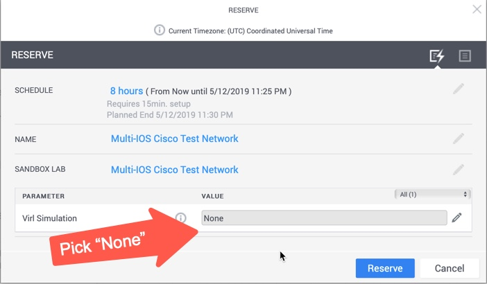

# Network Info Scripts Examples
This repository contains a sampling of Python scripts that can be used to gather information from the network using different libraries and tools available to network automation engineers.  

* [Setup a DevNet Sandbox to Use](#setup-a-test-network-with-devnet-sandbox)
* [Jump to the Demos!](#running-the-demos)

> Many of these samples started as examples I created during video sessions with [David Bombal](https://www.youtube.com/playlist?list=PLhfrWIlLOoKMduetaIJgOoQCyfiJNEX74). 

Feel free to use any of the examples you find here as you wish, but I highly suggest testing them out in a lab environment (such as the [DevNet Sandbox](https://devnetsandbox.cisco.com/RM/Diagram/Index/6b023525-4e7f-4755-81ae-05ac500d464a?diagramType=Topology) shown below) before using them in a production network. 

If you've any ideas or requests for other samples, feel free to open up an [Issue](issue), but there is no SLA or guarantees provided :-) 

## Operating System and Development Environment Requirements 
These scripts and the examples assume you have already setup your laptop with the basic set of dev tools network automation engineers need.  If you need some help there, checkout the [DevNet Learning Labs on Development Environment Setup](http://developer.cisco.com/learning/modules/dev-setup)

### Windows 
Some of the Python libraries used in the examples require a Linux environment and won't run natively on Windows.  If you are Windows user, you can still run these examples using one of the options here.  

* [Windows Subsystem for Linux](https://docs.microsoft.com/en-us/windows/wsl/install-win10)
	* Method to install a Linux "app" on Windows 10
	* I did a [video on this with David Bombal](https://www.youtube.com/watch?v=vE5unuqIauE&list=PLhfrWIlLOoKMduetaIJgOoQCyfiJNEX74&index=12&t=0s) you can checkout.
* Run the exercises in a Docker Container 
	* If you are comfortable with Docker and working in a bash terminal, this is a great option. 
	* I actually have a ["DevBox" Container](https://hub.docker.com/r/hpreston/devbox) that you can use easily with: 
	
		```bash
		docker run -it hpreston/devbox 
		```
* Use a Linux VM
	* Many engineers I've talked with have setup a Linux VM on their Windows workstations for this specific need.  

## Setup a Test Network with DevNet Sandbox

All of the scripts have been built and tested using the [DevNet Multi-IOS Sandbox](https://devnetsandbox.cisco.com/RM/Diagram/Index/6b023525-4e7f-4755-81ae-05ac500d464a?diagramType=Topology), a free development lab available for anyone to reserve and use.  An easy way to try them yourself is to reserve a lab and follow along.  

> Note: If you have your own VIRL server available, you of course use it instead. 

1. First, reserve a Sandbox and connect to its VPN (details provided in email or in the Sandbox Portal). When reserving, you can pick "None" as the VIRL Simulation as we'll be starting one up momentarily. 

	

1. We are "network developers" so we'll be using our Python and API skills for these examples.  Let's setup a Python3 virtual environment and install the great [virlutils](https://pypi.org/project/virlutils/) library to get our sample network working. 
	
	> One method of creating a venv is shown here, feel free to use whatever method you prefer and works on your platform. 
	
	```bash
	python3 -m venv venv 
	source venv/bin/activate 
	pip install virlutils 
	``` 

1. Now we can start our network simulation.  If you've your own topology file, feel free to use that.  Otherwise let's start up one of the samples. 

	```bash
	virl up virlfiles/5_router_mesh
	```
	
1. Monitor the status of the network start with `virl` commands.  For example: 

	```bash
	# See the nodes in the simulation 
	virl nodes
	
	# Connect to Console of a node 
	virl console iosv-1
	
	# Connect to SSH 
	virl ssh iosv-1
	
	# See all commands in help 
	virl --help 
	```

1. Some of these examples will leverage Ansible and/or pyATS/Genie within them.  virlutils provides an easy way to generate inventory for both from your simulation. 

	```bash
	# Create an Ansible Inventory File called inventory.yaml
	virl generate ansible -o inventory.yaml
	
	# Create a pyATS/Genie Testbed File called testbed.yaml
	virl generate pyats -o testbed.yaml
	```
	
	> Note: [Ansible](https://docs.ansible.com/ansible/latest/user_guide/windows_faq.html#can-ansible-run-on-windows) and [pyATS/Genie](https://developer.cisco.com/pyats/) examples require a Linux or macOS environment and won't work on Windows.  See [above](#windows) for tips if you're a Windows user.


## Running the Demos
Checkout some of the demo's included. 

> Note: This repo and examples started on May 11th, 2019 and is a work in progress in case you're wondering why so few examples so far :-)

* [Interface MAC Address Report](#interface-mac-address-report)

### Interface MAC Address Report
Let's create a CSV file containing all the MAC addresses for every interface in our network.  

> Note: This example leverages the [Genie library](http://developer.cisco.com/pyats/) and requires a macOS or Linux environment.

**Libraries Used**

* [`genie`](https://pypi.org/project/genie/) - To gather network interface details
* [`csv`](https://docs.python.org/3.7/library/csv.html) - To write out details to a CSV file

1. Install the necessary Python libraries into your virtual environment. 

	```bash
	pip install genie virlutils
	```
	
	* A [`requirements.txt`](requirements.txt) file is included in the repo with all the libraries used for all examples.  You could `pip install -r requirements.txt` instead. 
	
	* `csv` is included with Python standard library

1. If you haven't already started your network simulation in VIRL and created the testbed file, do that now. 

	```bash
	virl up --provision virlfiles/5_router_mesh
	virl generate pyats -o testbed.yaml
	```

1. Genie will need the network credentials to connect to the devices.  The `virlutils` generated testbed file assumes you will have set Environment Variables for `PYATS_USERNAME`, `PYATS_PASSWORD` and `PYATS_AUTH_PASS`. 

	```yaml
	# from testbed.yaml file
	testbed:		
	  name: network_info
	  tacacs:
	    username: "%ENV{PYATS_USERNAME}"
	  passwords:
	    tacacs: "%ENV{PYATS_PASSWORD}"
	    enable: "%ENV{PYATS_AUTH_PASS}"
	    line: "%ENV{PYATS_PASSWORD}"
	```

1. VIRL defaults to `cisco` for all of these.  This repository has a [`src_env`](src_env) file included that will set up these environment variables. Just "source" it. 
	
	```bash
	source src_env
	```

1. Run the script to generate the report. 

	```
	python interface_report.py
	```
	
	* While this script runs, you'll see output in your terminal of Genie connecting to each device and running the commands to gather info.  
	* It will take a minute or two to complete. 

1. Take a look at `interfaces.csv` file to see the data. Here I'll use `less`, but you can leverage Excel or any other program you wish. 

	```bash
	less interfaces.csv
	
	# Partial sample output 
	Device,Interface,MAC Address
	iosv-1,GigabitEthernet0/0,5e00.8000.0000
	iosv-1,GigabitEthernet0/1,fa16.3ea0.2e5e
	iosv-1,GigabitEthernet0/2,fa16.3e01.3226
	iosv-1,GigabitEthernet0/3,fa16.3ecc.abc5
	iosv-1,GigabitEthernet0/4,fa16.3ecd.dc7b
	iosv-1,Loopback0,N/A
	iosv-2,GigabitEthernet0/0,5e00.8001.0000
	iosv-2,GigabitEthernet0/1,fa16.3e99.d270
	iosv-2,GigabitEthernet0/2,fa16.3ee3.4fcf
	iosv-2,GigabitEthernet0/3,fa16.3e51.be1c
	iosv-2,GigabitEthernet0/4,fa16.3e05.6cd7
	```
